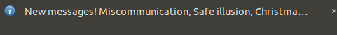

# Scraping saigaslife.nl

Because I want to get a notification any time there is a new post.

On Ubuntu, run ./check_and_notify.sh to get a notification with any new messages:

It will also open the site in the default browser (possibly in an existing window).

To have it run on login, put `/path/to/scrape-saigaslife/check_and_notify.sh` at the end of `~/.profile`.
